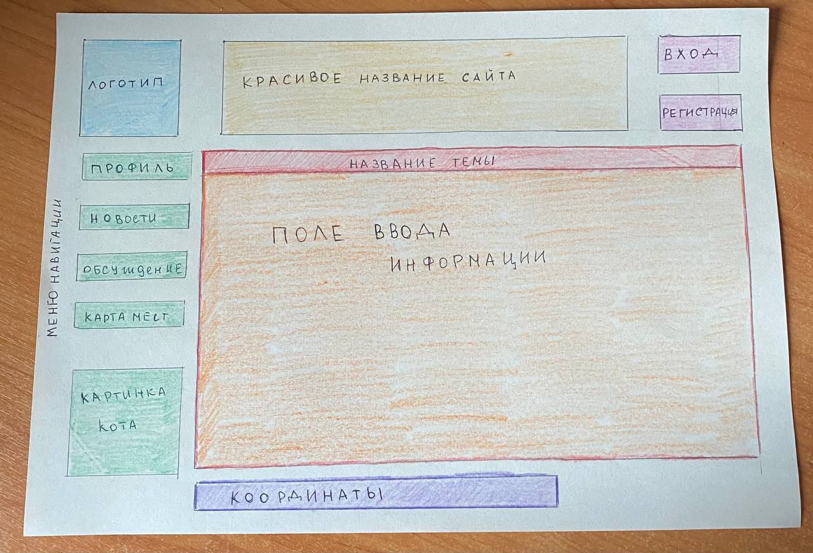

### Книжный клуб
***Описание:*** книжный клуб - сайт, с помощью которого пользователи смогут обсуждать любимые книги, видеть новости (например, выход новых книг и их описание), а так же места, в которых можно обменяться книгами или встретиться и обсудить вживую выбранную тему.
***
***Цель:*** общение, получение знаний.
***
***Макет***
***

***
***Работа принадлежит:*** Васютинской Ксении Сергеевне M33011.